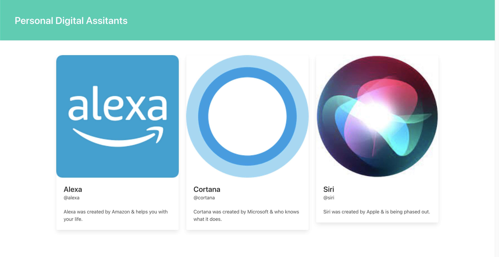

# React_PDA_Dashboard

Repository created following this [Udemy Course](https://www.udemy.com/course/react-redux/) to practice the following basic React concepts:

- Component encapsulation.
- Basic props handling

## Application

Application just displays some fix information about Personal Digital Assistants. This information is contained in cards, using the Bulma CSS framework.



## Run Locally

Clone the project

```bash
  git clone https://github.com/pedrolopezbiedma/React_PDA_Dashboard.git
```

Install dependencies

```bash
  npm install
```

Start the application

```bash
  npm run start
```

## Authors

- [@pedrolopezbiedma](https://github.com/pedrolopezbiedma)
